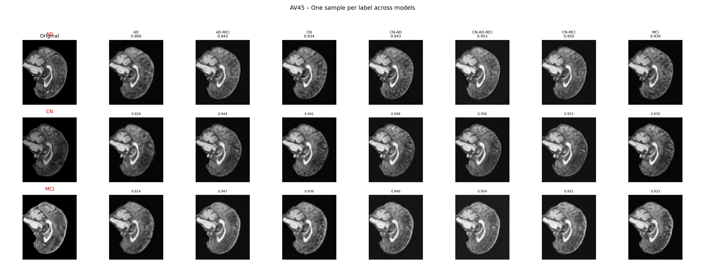
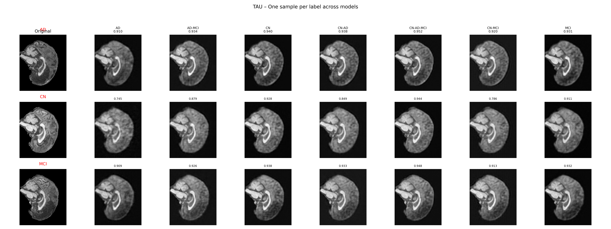

# AutoEncoder for PET Modality Reconstruction

This repository contains PyTorch/MONAI code for training and analysing 3-D auto-encoders (AEs) on PET brain images (**AV45** and **TAU** tracers).

## Features

* ⚡ **Training** – `code/train_ae.py` supports mixed precision, min-max scaling, smart cropping (96×128×96) and automatic experiment bookkeeping.
* 📊 **Evaluation** – `analysis/evaluate_holdout.py` computes SSIM on subject-wise hold-out sets (10 per modality & diagnosis).
* 🎨 **Visualisation** – `analysis/visualize_holdout.py` generates publication-ready PNGs comparing original vs. reconstruction across models.
* 🔗 **Automation** – `code/run_all_experiments.py` launches the full grid of 14 experiments (single & combined labels) with one command.

## Repository Structure

```text
exp1.encoder/
├── code/                # Training pipeline
│   ├── train_ae.py
│   ├── dataset.py
│   ├── monai_ae.py
│   ├── utils.py
│   └── run_all_experiments.py
├── analysis/            # Evaluation & plots
│   ├── evaluate_holdout.py
│   ├── visualize_holdout.py
│   └── prepare_holdout_labeled.py
├── requirements.txt
└── README.md            # You are here
```

> **Note** – Large data (CSV, NIfTI) and model checkpoints are excluded via `.gitignore`.

## Quick Start

```bash
# 1. Install dependencies
pip install -r requirements.txt

# 2. Train an AE (example: AV45, AD vs. CN)
python code/train_ae.py \
  --csv /path/to/AV45-data.csv \
  --labels AD CN \
  --modality AV45 \
  --out_dir results/AV45_AD \
  --epochs 50 --batch 4 --amp

# 3. Evaluate & plot hold-out reconstruction quality
python analysis/evaluate_holdout.py \
  --results_dir results \
  --csv_dir /path/to/source_data \
  --analysis_dir analysis

python analysis/visualize_holdout.py \
  --results_dir results \
  --csv_dir /path/to/source_data \
  --analysis_dir analysis
```

## Example Results (hold-out subjects)

### AV45



### TAU



Rows correspond to diagnosis labels (AD, CN, MCI). Columns show the original PET slice followed by reconstructions from each trained auto-encoder. Numbers below each reconstruction are SSIM scores (higher is better).

## Citation
If you use this code in your research, please cite:

```bibtex
@inproceedings{YourName2025AutoEncoderPET,
  title     = {Self-Supervised Auto-Encoding of Multi-Tracer PET for Early Alzheimer's Detection},
  author    = {Your Name and Collaborators},
  booktitle = {MICCAI},
  year      = {2025}
}
```

## License
This project is released under the MIT License – see `LICENSE` for details. 
